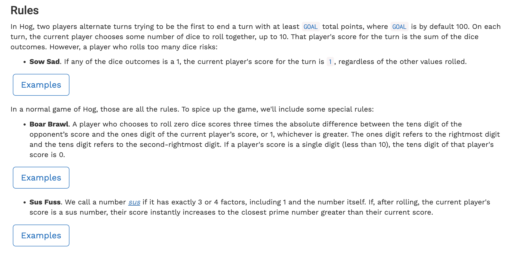
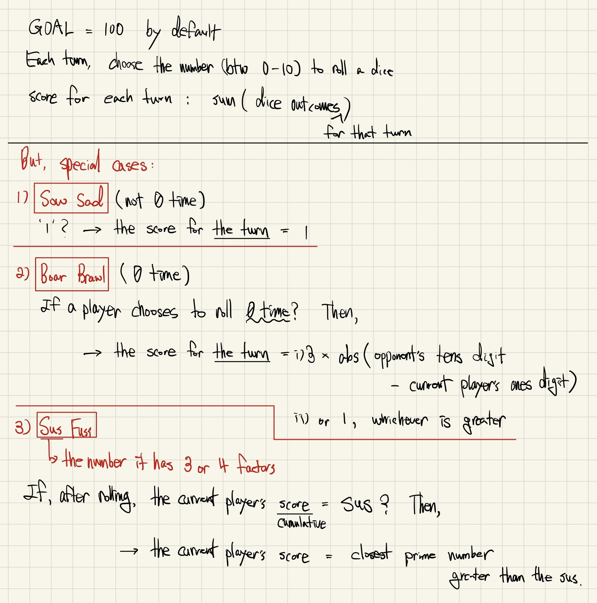
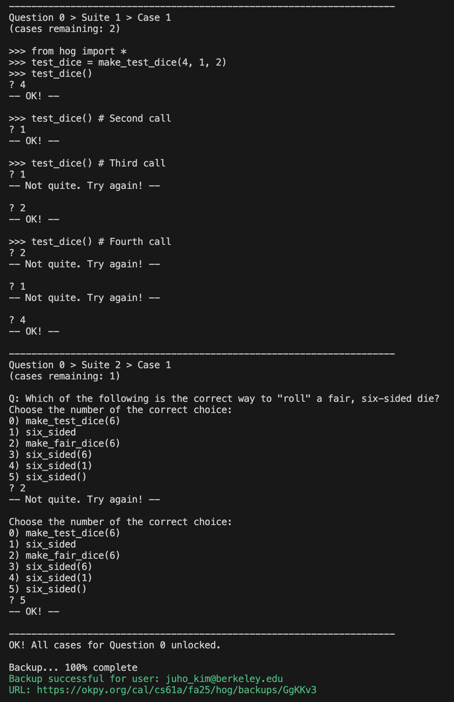
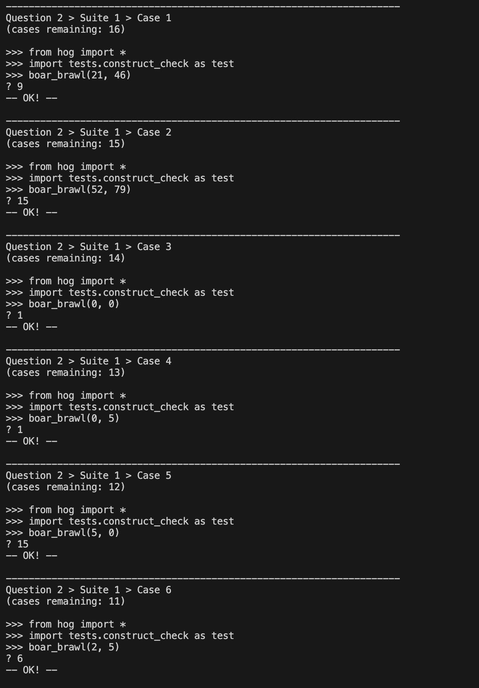
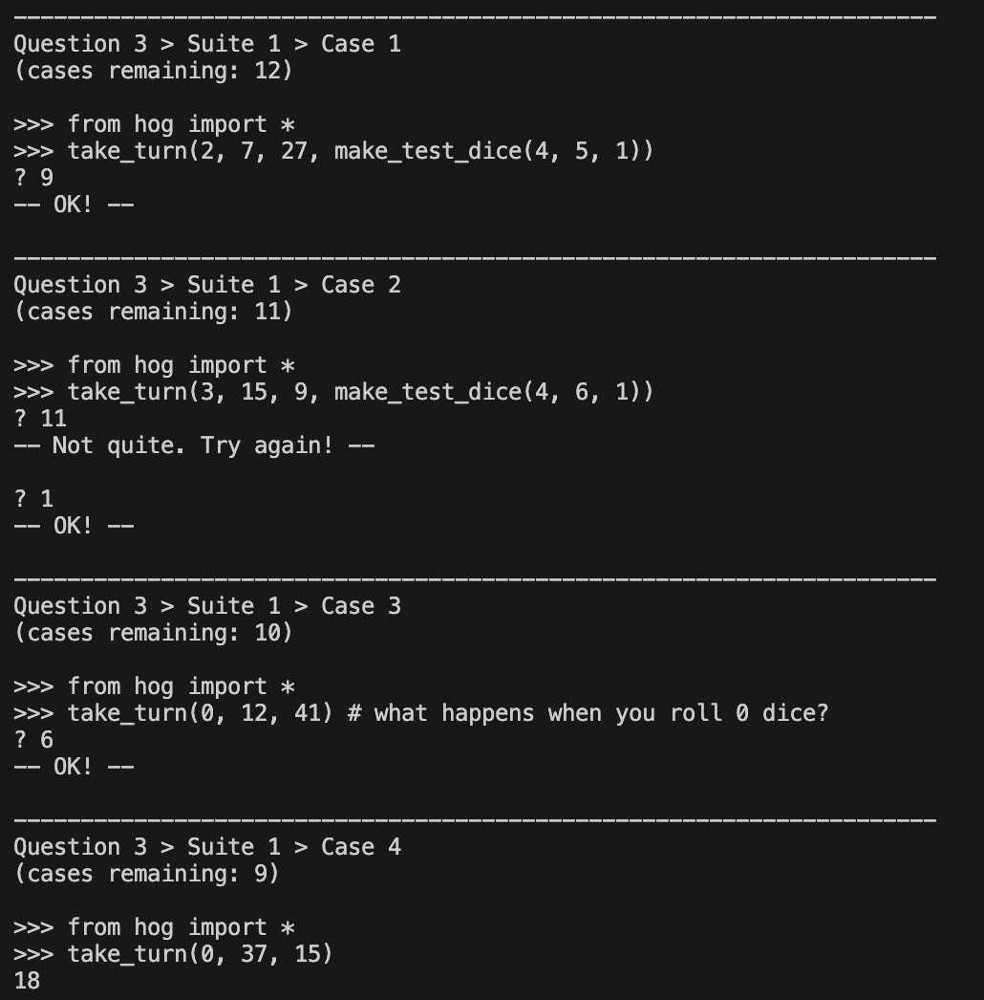

# [The Game of Hog](https://cs61a.org/proj/hog/)

## Rules





## Problems

### Problem 0



### Problem 1

.png)

.png)

.png)

#### Code

```python
def roll_dice(num_rolls, dice=six_sided):
    """Simulate rolling the DICE exactly NUM_ROLLS > 0 times. Return the sum of
    the outcomes unless any of the outcomes is 1. In that case, return 1.

    num_rolls:  The number of dice rolls that will be made.
    dice:       A function that simulates a single dice roll outcome. Defaults to the six sided dice.
    """
    # These assert statements ensure that num_rolls is a positive integer.
    assert type(num_rolls) == int, "num_rolls must be an integer."
    assert num_rolls > 0, "Must roll at least once."
    # BEGIN PROBLEM 1
    "*** YOUR CODE HERE ***"
    # to keep track of numbers
    total = 0
    found_one = False   # to track if any roll was 1
    num_of_loops = 0

    while num_of_loops < num_rolls:
        result = dice()
        if result == 1:
            found_one = True
        total += result
        num_of_loops += 1   # I forgot this

    if found_one == True:
        return 1
    else:
        return total
    # END PROBLEM 1
```

#### Major Mistakes That I Made at First

**1. Forgetting the Sow Sad Rule**
- Calculated sums correctly (4+1+2=7) but ignored that ANY roll of 1 makes the entire turn score = 1
- This rule overrides all other calculations in `roll_dice`

**2. Misunderstanding Test Dice Behavior**
- **Single value**: `make_test_dice(6)` returns 6 every time, not a cycle
- **Multiple values**: `make_test_dice(3,2,2)` cycles through the sequence
- I confused these two cases

**3. Applying Wrong Rules**
- I tried to apply Sus Fuss rule in Problem 1, but it doesn't exist yet
- Problem 1 only handles: dice rolling + Sow Sad rule

**4. Not Tracking Dice State**
- Test dice remember their position between function calls
- After `roll_dice(3, dice)`, the dice continues **from where it left off**
- Must call `dice()` exactly the specified number of times

#### Key Distinctions to Remember

**Rule Hierarchy for Problem 1:**
1. Roll dice `num_rolls` times
2. Check for Sow Sad (any 1 = return 1)
3. If no 1s, return sum

**Test Dice Patterns:**
- `make_test_dice(6)` -> always returns 6
- `make_test_dice(1,2,3)` -> cycles: 1,2,3,1,2,3...
- State persists between function calls

**What Problem 1 Does NOT Include:**
- Sus Fuss rule (comes in Problem 4)
- Boar Brawl rule (comes in Problem 2)
- Only basic rolling + Sow Sad

### Problem 2



#### Code

```python
def boar_brawl(player_score, opponent_score):
    """Return the points scored when the current player rolls 0 dice according to Boar Brawl.

    player_score:     The total score of the current player.
    opponent_score:   The total score of the other player.

    """
    # BEGIN PROBLEM 2
    "*** YOUR CODE HERE ***"
    result = 0
    oppo_tens = (opponent_score // 10) % 10
    play_ones = player_score % 10
    total = 3 * abs(oppo_tens - play_ones)

    if total == 0:
        result = 1
    else:
        result = total
    return result
    # END PROBLEM 2
```

### Problem 3



#### Again, Same Mistake from Problem 1

**Forgetting the Sow Sad Rule**
- Calculated sums correctly (4+6+1=11) but ignored that ANY roll of 1 makes the entire turn score = 1
- This rule overrides all other calculations in `roll_dice`

#### Code

```python
def take_turn(num_rolls, player_score, opponent_score, dice=six_sided):
    """Return the points scored on a turn rolling NUM_ROLLS dice when the
    current player has PLAYER_SCORE points and the opponent has OPPONENT_SCORE points.

    num_rolls:       The number of dice rolls that will be made.
    player_score:    The total score of the current player.
    opponent_score:  The total score of the other player.
    dice:            A function that simulates a single dice roll outcome.
    """
    # Leave these assert statements here; they help check for errors.
    assert type(num_rolls) == int, "num_rolls must be an integer."
    assert num_rolls >= 0, "Cannot roll a negative number of dice in take_turn."
    assert num_rolls <= 10, "Cannot roll more than 10 dice."
    # BEGIN PROBLEM 3
    "*** YOUR CODE HERE ***"
    result = 0
    if num_rolls == 0:
        result = boar_brawl(player_score, opponent_score)
    else:
        result = roll_dice(num_rolls, dice)
    return result
    # END PROBLEM 3
```